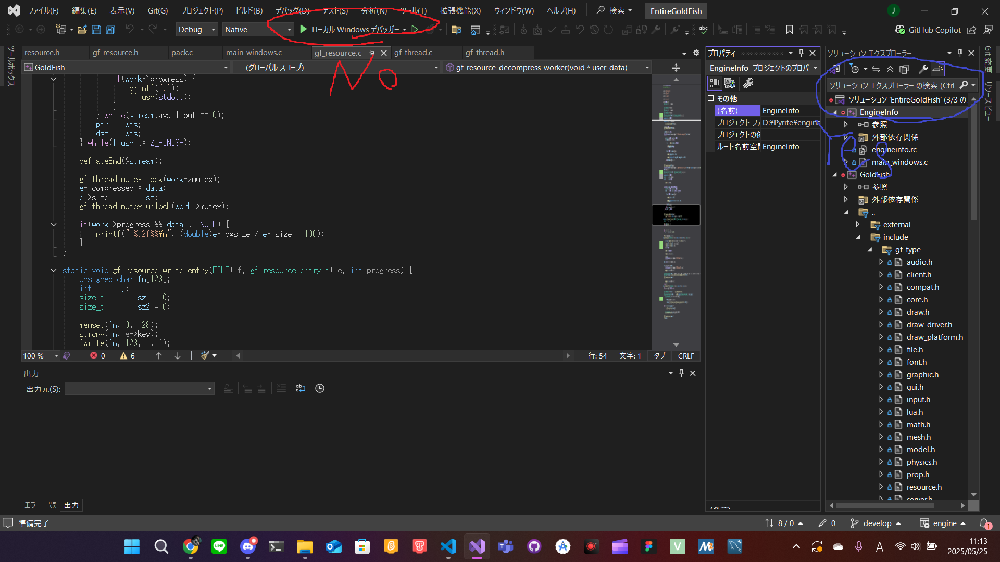
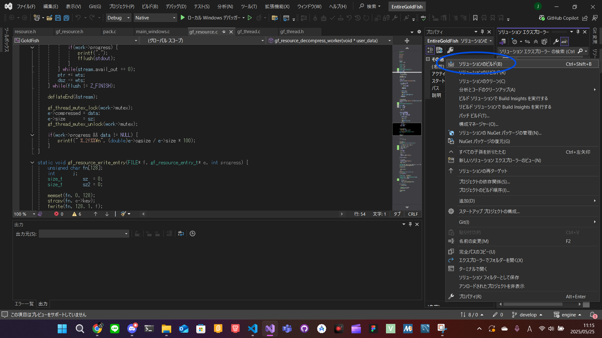

# Building GoldFish
Requirements:
 - [premake5](https://premake.github.io/download/)
 - [gmake](https://www.gnu.org/software/make/manual/make.html) (Not required for MSVC build.)
 - [GCC](https://gcc.gnu.org/), [MSVC](https://visualstudio.microsoft.com/ja/vs/features/cplusplus/) or [MinGW](https://www.mingw-w64.org/).

1. Clone the repository

   `git clone https://github.com/pyrite-dev/goldfish --recursive`
2. Create platform-dependent build files

   See `--help` for more information about build configuration

   - GCC / MinGW

     `premake5 --file=build.lua gmake`
   - MSVC

     `premake5 --file=build.lua vs2022 --cc=msc --opengl=gdi`
3. Build
  - GCC

    `make -j4`
  - MinGW

    `make -j4 config=<config>_<platform>`
    
    `<config>` must be `debug` or `release`, and `<platform>` must be `win32` or `win64`.

  - MSVC
    1. Open the generated `EntireGoldFish.sln`
    2. 
    3. 
